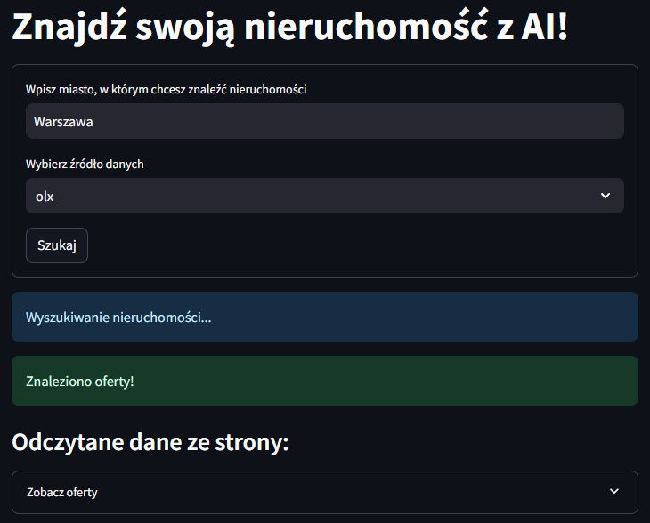
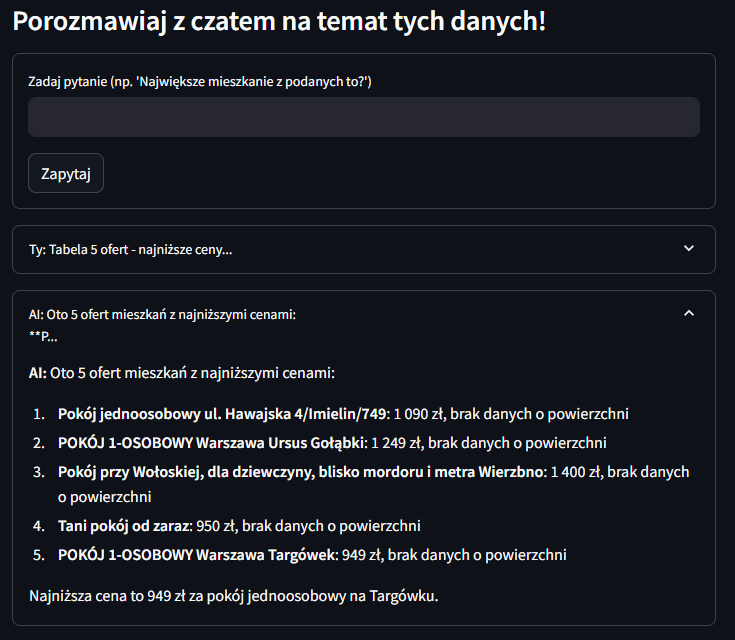

# AI Real Estate Assistant

This project is a full-stack AI-powered real estate assistant that helps users find property listings in Polish cities and interact with them through a chatbot interface. The backend scrapes real estate data from OLX, Gratka, and Otodom, and the frontend (Streamlit) allows users to search, view listings, and chat with an LLM to analyze the data.

---

## Features

- Search listings from OLX, Gratka, or Otodom
- Chatbot interaction with a local LLM (via FastAPI)
- Structured and clean listings display
- Smart Q&A with listings (e.g., "Which is the cheapest apartment?")
- Remembers full conversation history
- User selects source and city for search

---

## Tech Stack

| Layer     | Technology                |
|----------|---------------------------|
| Backend  | Python, FastAPI           |
| Frontend | Python, Streamlit         |
| Scraping | Selenium-based custom scrapers |
| AI       | Custom LLM query processor |
| Data     | JSON listings via HTTP APIs |

---

## Demo Screenshot



---

## Installation

1. **Clone the repository**
   ```bash
   git clone https://github.com/your-username/real-estate-ai.git
   cd real-estate-ai
2. **Create and activate a virtual environment**
   ```bash
   python -m venv venv
   source venv/bin/activate  # On Windows: venv\Scripts\activate
3. **Install dependencies**
   ```bash
   pip install -r requirements.txt
4. **Run the backend (FastAPI)**
   ```bash
   uvicorn backend.main:app --reload
4. **Run the frontend (Streamlit)**
   ```bash
   streamlit run app.py
